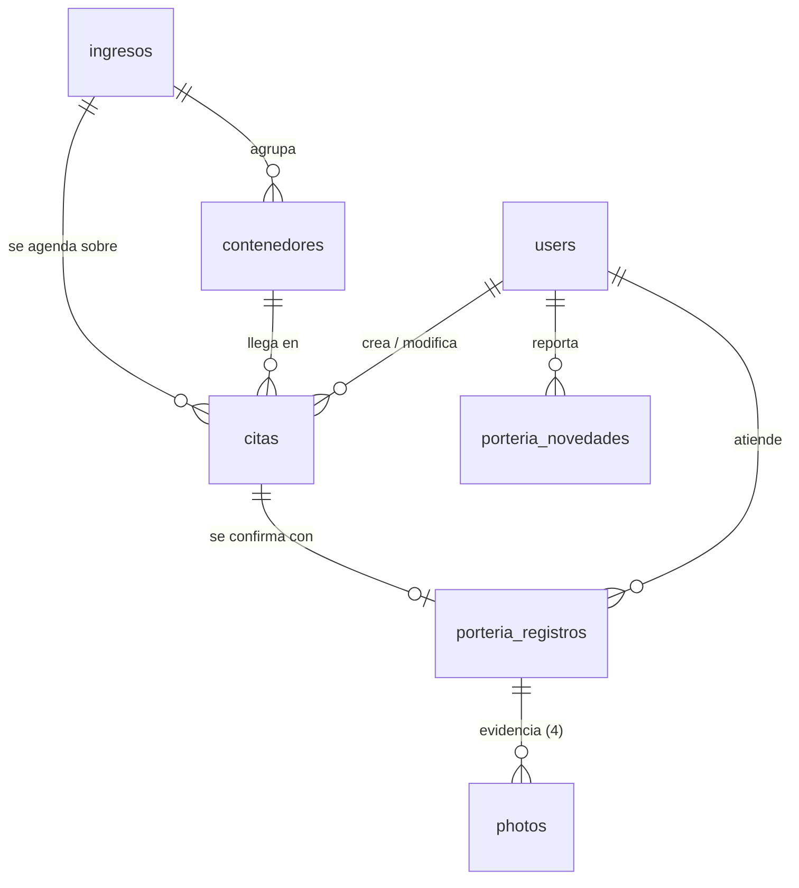

# Phase 1 — Data Model: Reorganización de roles + módulos Citas y Portero

**Feature**: `009-roles-citas-portero` | **Fecha**: 2026-07-27

**Resumen**: 3 tablas nuevas. **Cero cambios de esquema** en tablas existentes. Se reutiliza `photos` (polimórfica) para las evidencias.

---

## Diagrama de relaciones



---

## Tabla nueva: `citas`

Llegada física prevista de un contenedor ya declarado en un ingreso.

| Columna | Tipo | Nulo | Notas |
|---------|------|------|-------|
| `id` | bigint unsigned, PK | no | |
| `ingreso_id` | bigint unsigned, FK → `ingresos.id` | no | `onDelete('cascade')` |
| `contenedor_id` | bigint unsigned, FK → `contenedores.id` | no | `onDelete('cascade')` |
| `numero_contenedor` | string(20) | no | Copia normalizada (mayúsculas, sin separadores) del contenedor, para que el portero busque por índice |
| `tipo` | string(20) | no | Enum `TipoContenedor` |
| `tamano` | string(10) | no | Enum `TamanoContenedor` |
| `condicion` | string(10) | no | Enum `CitaCondicion`: `full` / `vacio` |
| `fecha_esperada` | date | no | Día de llegada previsto. Admite fecha pasada (agendamiento retroactivo) |
| `estado` | string(20) | no | Enum `CitaEstado`, valores persistidos: `programada`, `atendida`, `cancelada`. **`vencida` nunca se persiste** — ver D-001 |
| `conductor_nombre` | string(150) | no | |
| `conductor_cedula` | string(30) | no | Normalizada: sin puntos ni espacios |
| `conductor_cedula_original` | string(40) | sí | Tal como se digitó, para mostrar |
| `placa` | string(15) | no | Normalizada: mayúsculas, sin guiones ni espacios |
| `placa_original` | string(20) | sí | Tal como se digitó, para mostrar |
| `empresa` | string(150) | no | Nombre de la empresa transportadora |
| `creado_por` | bigint unsigned, FK → `users.id` | no | |
| `actualizado_por` | bigint unsigned, FK → `users.id` | sí | Último que modificó |
| `created_at` / `updated_at` | timestamp | sí | |

**Índices**:
- `(fecha_esperada, estado)` — consulta principal del portero: citas del día en estado programada
- `(placa)` — búsqueda del portero por placa (SC-012)
- `(numero_contenedor)` — búsqueda del portero por contenedor
- `(ingreso_id)`, `(contenedor_id)` — implícitos por FK; sirven a FR-047

**Reglas de validación** (`StoreCitaRequest` / `UpdateCitaRequest`):

| Campo | Regla | Requisito |
|-------|-------|-----------|
| `ingreso_id` | `required`, `exists:ingresos,id` | FR-002 |
| `contenedor_id` | `required`, `exists:contenedores,id`, debe pertenecer al `ingreso_id` enviado | FR-002 |
| `tipo` | `required`, `Rule::enum(TipoContenedor::class)` | FR-001 |
| `tamano` | `required`, `Rule::enum(TamanoContenedor::class)` | FR-001 |
| `condicion` | `required`, `Rule::enum(CitaCondicion::class)` | FR-005 |
| `fecha_esperada` | `required`, `date` — **sin** `after_or_equal:today` | FR-001, permite retroactivo |
| `conductor_nombre` | `required`, `string`, `max:150` | FR-003 |
| `conductor_cedula` | `required`, `string`, `max:40` | FR-003 |
| `placa` | `required`, `string`, `max:20` | FR-003 |
| `empresa` | `required`, `string`, `max:150` | FR-003 |

La validación cruzada contenedor↔ingreso va en `withValidator()`, siguiendo el patrón de `StoreIngresoMercanciaRequest`.

**Estados y transiciones**:

```
                  ┌──────────────┐
   (creación) ──► │  programada  │
                  └──────┬───────┘
                         │
        ┌────────────────┼────────────────┐
        ▼                ▼                ▼
   ┌──────────┐    ┌───────────┐   ╔═══════════╗
   │ atendida │    │ cancelada │   ║  vencida  ║  ← derivado, no persistido:
   └──────────┘    └───────────┘   ╚═══════════╝    estado=programada AND
   (portero          (rol citas)                    fecha_esperada < hoy
    confirma)                                       Reprogramable: cambiar
                                                    fecha_esperada la devuelve
                                                    a "programada" efectiva
```

- `programada → atendida`: solo el módulo Portero, al confirmar con las 4 fotos (FR-020).
- `programada → cancelada`: solo el rol `citas` (FR-008).
- `atendida` es terminal: no admite edición ni reconfirmación (FR-008, FR-021).
- **`vencida` no es una transición**: es cómo se ve una cita `programada` con fecha pasada. Reprogramarla (editar `fecha_esperada`) la vuelve a mostrar como `programada` sin cambiar la columna (FR-010).

**Métodos del modelo `Cita`**:
- `estadoEfectivo(): CitaEstado` — devuelve `Vencida` si aplica la regla derivada, si no el valor persistido
- `scopeDelDia($query)` — `whereDate('fecha_esperada', today())`
- `scopeVencidas($query)` — `where('estado', Programada)->whereDate('fecha_esperada', '<', today())`
- `scopeBuscar($query, string $termino)` — normaliza el término y compara contra `placa` y `numero_contenedor`
- `puedeEditarse(): bool` — `estado === Programada`
- Relaciones: `ingreso()`, `contenedor()`, `registroPorteria()` (hasOne), `creador()`, `editor()`

---

## Tabla nueva: `porteria_registros`

Confirmación física de que la cita se materializó en la puerta.

| Columna | Tipo | Nulo | Notas |
|---------|------|------|-------|
| `id` | bigint unsigned, PK | no | |
| `cita_id` | bigint unsigned, FK → `citas.id` | no | **UNIQUE** — garantiza una sola llegada por cita (D-008, FR-021) |
| `portero_id` | bigint unsigned, FK → `users.id` | no | Quién atendió |
| `llegada_at` | datetime | no | Fecha y hora **reales** de la llegada (FR-020) |
| `observaciones` | text | sí | Diferencias con lo agendado, si las hubo |
| `created_at` / `updated_at` | timestamp | sí | |

**Índices**: `unique(cita_id)`, `(portero_id)`, `(llegada_at)`

**Relaciones**: `cita()` (belongsTo), `photos()` / `fotos()` (morphMany vía `HasPhotos`), `portero()` (belongsTo User)

**Evidencias fotográficas** — se guardan en la tabla `photos` existente:

| Campo de `photos` | Valor |
|-------------------|-------|
| `photoable_type` | `App\Models\PorteriaRegistro` |
| `photoable_id` | id del registro |
| `tipo` | `foto` |
| `categoria` | `vehiculo` / `contenedor` / `sello` / `tiquete` (enum `PorteriaFotoCategoria`) |
| `ruta` | `porteria/{registro_id}/...` |

Las cuatro son obligatorias (FR-019). Validación en `StorePorteriaLlegadaRequest`:

```
foto_vehiculo   => required|image|mimes:jpg,jpeg,png|max:10240
foto_contenedor => required|image|mimes:jpg,jpeg,png|max:10240
foto_sello      => required|image|mimes:jpg,jpeg,png|max:10240
foto_tiquete    => required|image|mimes:jpg,jpeg,png|max:10240
observaciones   => nullable|string|max:500
```

Mismos límites que `StoreSalidaMercanciaRequest`, por consistencia.

---

## Tabla nueva: `porteria_novedades`

Constancia de un vehículo que se presentó sin cita para la fecha actual (FR-022).

| Columna | Tipo | Nulo | Notas |
|---------|------|------|-------|
| `id` | bigint unsigned, PK | no | |
| `portero_id` | bigint unsigned, FK → `users.id` | no | |
| `placa` | string(20) | sí | Normalizada. Al menos uno de placa/contenedor es obligatorio |
| `numero_contenedor` | string(20) | sí | Normalizado |
| `descripcion` | text | no | Qué pasó |
| `reportado_at` | datetime | no | |
| `created_at` / `updated_at` | timestamp | sí | |

**Índices**: `(reportado_at)`, `(placa)`

**Regla de negocio**: no crea ni modifica ninguna cita (FR-022). Es un registro suelto para revisión posterior.

**Validación** (`StorePorteriaNovedadRequest`): `placa` y `numero_contenedor` son `nullable` individualmente pero `required_without` mutuo; `descripcion` es `required|string|max:500`.

---

## Enums nuevos (`app/Enums/`)

Todos respaldados por string, casteados en el modelo — patrón de `ContenedorEstado` y `NovedadTipo`.

| Enum | Casos | Uso |
|------|-------|-----|
| `CitaEstado` | `Programada`, `Atendida`, `Vencida`, `Cancelada` | `citas.estado` (`Vencida` solo se produce en lectura) |
| `CitaCondicion` | `Full`, `Vacio` | `citas.condicion` |
| `TipoContenedor` | `Dry`, `Reefer`, `OpenTop`, `FlatRack`, `Tank` | `citas.tipo` |
| `TamanoContenedor` | `Veinte` (20), `Cuarenta` (40), `CuarentaHC` (40hc), `CuarentaYCinco` (45) | `citas.tamano` |
| `PorteriaFotoCategoria` | `Vehiculo`, `Contenedor`, `Sello`, `Tiquete` | `photos.categoria` |

Cada enum expone `etiqueta(): string` con el nombre legible en español para las vistas, siguiendo la convención del proyecto.

---

## Permisos nuevos (Spatie)

| Permiso | Concede |
|---------|---------|
| `citas.ver` | Listar y consultar citas |
| `citas.crear` | Crear una cita |
| `citas.editar` | Editar y cancelar una cita en estado programada |
| `porteria.ver` | Ver las citas del día en el módulo Portero |
| `porteria.registrar` | Confirmar una llegada y reportar una novedad |

---

## Cambios en configuración

**`config/modulos.php`** — dos claves nuevas:

```php
'citas'    => true,
'porteria' => true,
```

**`config/roles.php`** — archivo nuevo:

```php
return [
    // Roles retirados de circulación: no aparecen en el selector de asignación
    // ni pueden asignarse. Los usuarios que YA los tienen conservan sus permisos.
    // Volver a sacar un rol de esta lista lo reactiva (reversible, sin migración).
    'retirados' => ['coordinador', 'despachador', 'gerente', 'operador'],
];
```

---

## Sin cambios de esquema en tablas existentes

Confirmado contra el código:

| Tabla | Por qué no cambia |
|-------|-------------------|
| `ingresos` | La cita apunta al ingreso, no al revés (R-002: el módulo Ingreso no se modifica) |
| `contenedores` | `tipo` ya existe como columna libre pero el formulario de ingreso no la usa; la cita captura tipo y tamaño por su cuenta |
| `photos` | `categoria` ya existe desde `2026_06_25_000007` |
| `users`, `roles`, `permissions` | El retiro de roles es una bandera de config, no una columna (D-003) |
| `referencias`, `movimientos_inventario` | El scoping de cliente es un filtro de consulta, no un cambio de datos |
